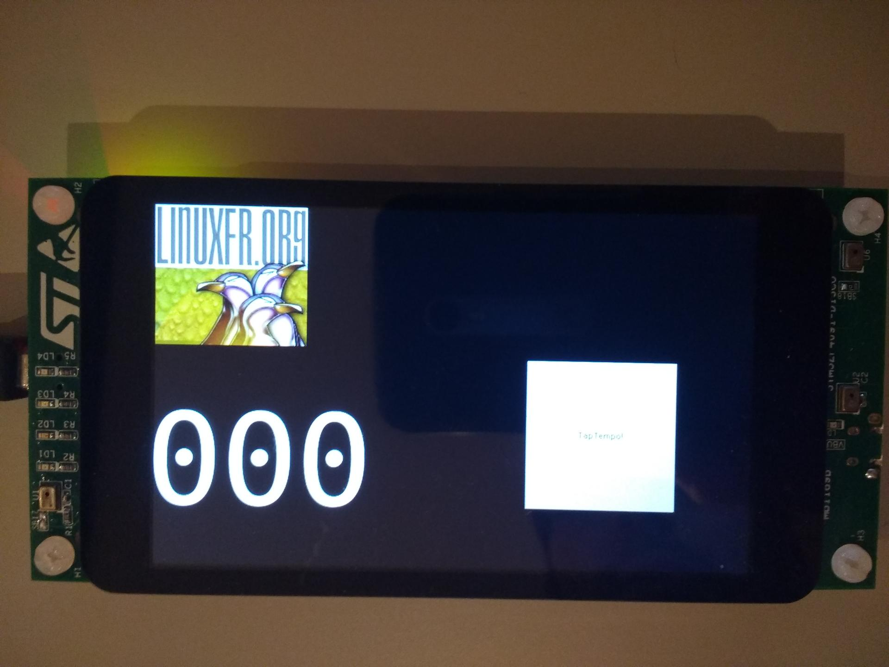

# TapTempo sur STM32F469i-Discovery

Voici une implémentation de TapTempo sur microcontrôleur. C'est un peu le "Hello, world!" 2.0  de l'embarqué car il permet de valider plusieurs périphériques et configurations en un seul coup : l'affichage (driver LCD, librairie graphique ...), un bouton (test de l'algorithme de debouncing) ou touch screen, ainsi que la bonne fréquene du processeur et du système sous jacent (timer OS ou hardware).


la cible embarquée n'est pas un Arduino mais un coeur plus puissant : un Cortex-M4 à 180Mhz de chez ST Micro, plus précisément le modèle STM32F462 intégré sur une carte de développement appelée discovery. Celle-ci embarque un bon nombre de périphériques dont un très beau LCD de 4 pouces avec capteur capacitif.

L'exemple n'utilise pas de RTOS mais un scheduler simple proposé par la librairie graphique utilisée ici : uGfx. La librairie propose des widgets classiques, j'en utilise un ici, le bouton servant à capturer les appuis digitaux (pas numérique, le doigt quoi).

Les digits sont des images BMP générées avec ImageMagick par la commande suivante :

convert -background black -fill white -gravity Center -size 100x200 -font DejaVu-Sans-Mono  caption:"0" 0.bmp

Puis, on les transforme en tableau d'octets :

```shell
./file2c -c -n digit_0 -f 0.bmp 0.bmp romfs_0.h
```

'file2c' étant un petit utiltaire fournit par uGfx. Notez que Linux intègre de base un utilitaire simulaire, je l'ai découvert il y a peu : 

```shell
xxd -i -a filename
```

On génère ainsi les 10 chiffres utilisés pour l'affichage des BMP (pas l'image mais le nombre d'appuis par seconde, faut suivre un peu !).

Un timer de 100ms périodique permet de réaliser notre calcul moyen de BMP, puis on rafraîchit l'écran toutes les secondes.

Enfin, l'absence d'appui pendant 3 secondes provoque une remise à zéro des calculs.

Je vous ai fait une petite vidéo et le code source est disponible sur github comme d'habitude, en attendant l'intégration dans le compte de la fédération Taptempo que je compte bien rejoindre.




